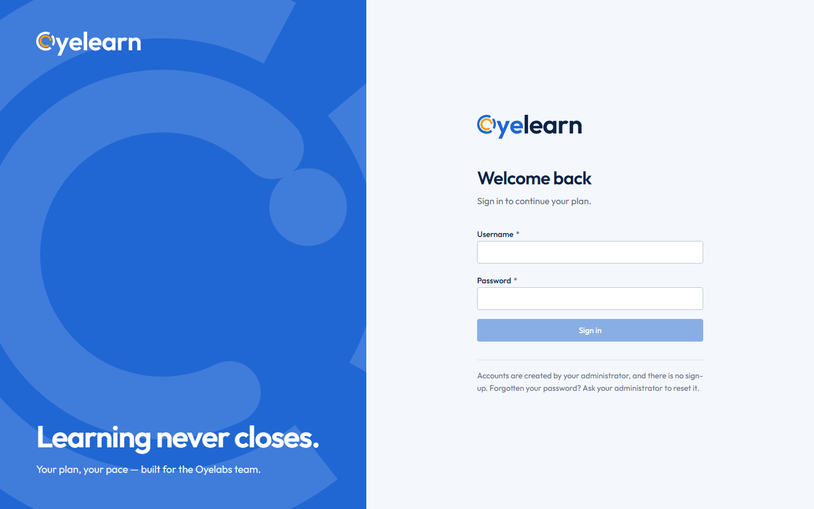
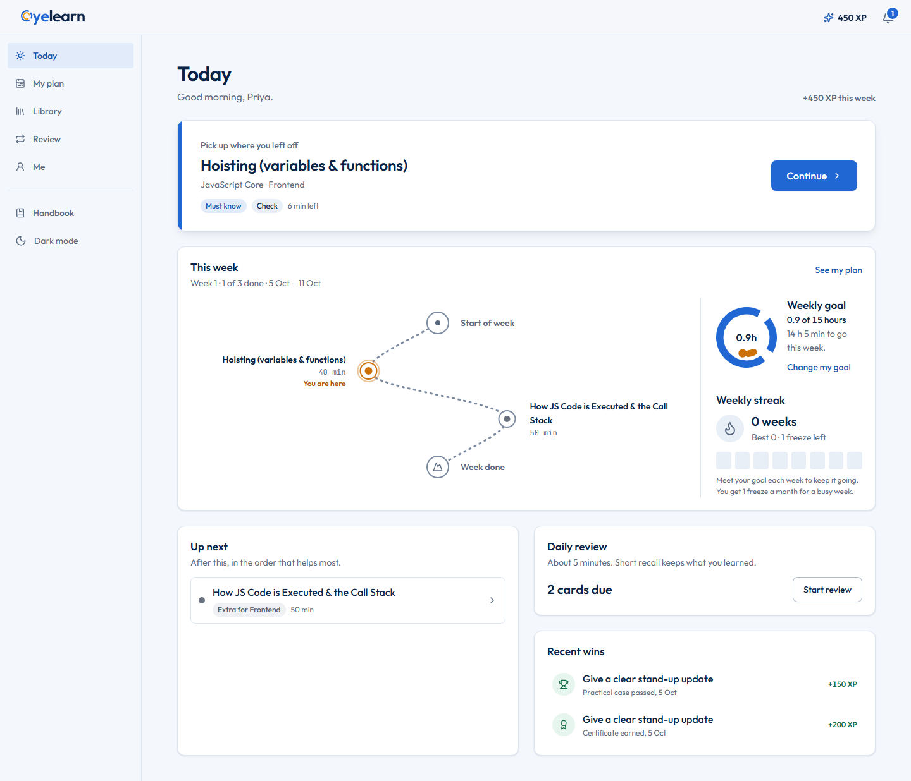
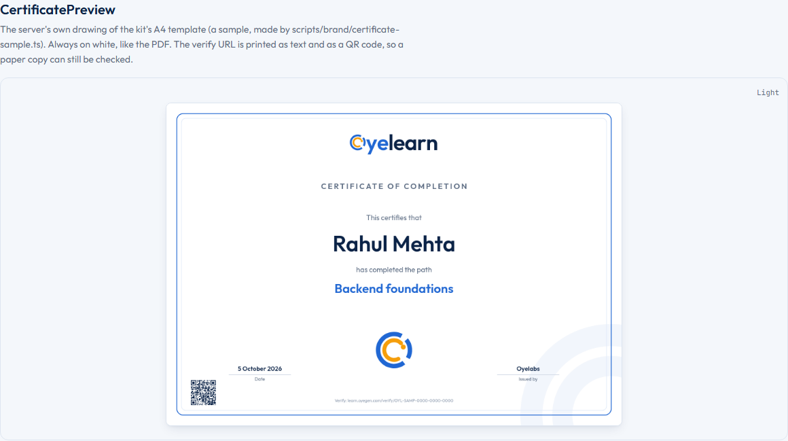

# Rebrand results (brand-v1.0)

Oyelearn now wears the brand kit v1.0 (`Oyelearn-Brand-Kit/`, rulebook `Oyelearn-Brand-Guidelines.pdf`):
"Blue leads. Amber celebrates." Phases 1 to 6 are committed (ada6875, e6735e5, f52e53e, 683dd21,
1c4f2f3, 92d2f70); Phase 7 (this clean-up, the checks and these notes) is in the working tree, uncommitted.
Decisions per phase: `DECISIONS.md`. Deploy: `DEPLOY.md`.

## Screens

Baselines from `scripts/e2e/brand-visual.ts` (390 and 1440 px, light and dark; 36 shots in `shots/`).

| Screen | Desktop light | Desktop dark | Phone light | Phone dark |
|---|---|---|---|---|
| Sign-in | [login-1440-light](shots/login-1440-light.png) | [login-1440-dark](shots/login-1440-dark.png) | [login-390-light](shots/login-390-light.png) | [login-390-dark](shots/login-390-dark.png) |
| Today | [today-1440-light](shots/today-1440-light.png) | [today-1440-dark](shots/today-1440-dark.png) | [today-390-light](shots/today-390-light.png) | [today-390-dark](shots/today-390-dark.png) |
| My plan | [plan-1440-light](shots/plan-1440-light.png) | [plan-1440-dark](shots/plan-1440-dark.png) | [plan-390-light](shots/plan-390-light.png) | [plan-390-dark](shots/plan-390-dark.png) |
| A lesson (Read) | [lesson-1440-light](shots/lesson-1440-light.png) | [lesson-1440-dark](shots/lesson-1440-dark.png) | [lesson-390-light](shots/lesson-390-light.png) | [lesson-390-dark](shots/lesson-390-dark.png) |
| Admin inbox | [admin-inbox-1440-light](shots/admin-inbox-1440-light.png) | [admin-inbox-1440-dark](shots/admin-inbox-1440-dark.png) | [admin-inbox-390-light](shots/admin-inbox-390-light.png) | [admin-inbox-390-dark](shots/admin-inbox-390-dark.png) |
| Certificate (learner) | [certificate-1440-light](shots/certificate-1440-light.png) | [certificate-1440-dark](shots/certificate-1440-dark.png) | [certificate-390-light](shots/certificate-390-light.png) | [certificate-390-dark](shots/certificate-390-dark.png) |
| Certificate preview (/design) | [design-certificate-1440-light](shots/design-certificate-1440-light.png) | [design-certificate-1440-dark](shots/design-certificate-1440-dark.png) | [design-certificate-390-light](shots/design-certificate-390-light.png) | [design-certificate-390-dark](shots/design-certificate-390-dark.png) |
| Verify (public) | [verify-1440-light](shots/verify-1440-light.png) | [verify-1440-dark](shots/verify-1440-dark.png) | [verify-390-light](shots/verify-390-light.png) | [verify-390-dark](shots/verify-390-dark.png) |
| 404 | [not-found-1440-light](shots/not-found-1440-light.png) | [not-found-1440-dark](shots/not-found-1440-dark.png) | [not-found-390-light](shots/not-found-390-light.png) | [not-found-390-dark](shots/not-found-390-dark.png) |

The full v5 set (22 screens × 4 widths × 2 themes) is re-shot in `docs/v5/shots/v5/` (`v5-visual.ts --update`).
The certificate shots use the server-drawn sample picture, since every run issues a new random code and QR.

## Files changed

`git diff --stat pre-rebrand..HEAD`: **754 files changed, 34,548 insertions, 2,400 deletions.** That range
also holds v4.5 Phases 1 to 5 (`pre-rebrand` was tagged on v4.5 Phase 0, and v4.5's commits interleave with
the rebrand's), so by commit:

| Commit | What | Files | + | − |
|---|---|---|---|---|
| ada6875 | Phase 1: kit assets, tokens, Outfit, Logo/Mark/Loader/ProgressRing, /design Brand section | 58 | 1,317 | 236 |
| e6735e5 | Phase 2: favicons, PWA icons, manifest, titles, OG/Twitter | 22 | 178 | 19 |
| f52e53e | Phase 3: sign-in split screen, auth/404/error screens, BrandLoader | 24 | 614 | 242 |
| 683dd21 | Phase 5: server certificates (PDF + PNG), verify page, admin, report PDF | 37 | 2,741 | 1,398 |
| 1c4f2f3 | Phase 6: email layout, certificate email, toasts, bell, per-page OG | 31 | 1,249 | 120 |
| 92d2f70 | Phase 4: shells, logos, amber progress, "you are here", summit ring, empty states, charts | 248 | 460 | 235 |
| Phase 7 (uncommitted) | clean-up, checks, deploy notes, baselines (below) | 239 | 1,451 | 1,007 |
| | *rebrand total, Phases 1–6* | *420* | *6,559* | *2,250* |

(883b898, v4.5 Phase 5, is the other commit in the range: 221 files, 1,526 / 103.) Phase 4's 248 files are
mostly one-line logo, token and class swaps across the old UI.

**By area:**
- **Brand assets** (`public/brand/`, `public/` icons, OG images, `server/assets/certificates/`): the kit's
  files byte for byte (unit tests compare them), plus the server-drawn certificate sample.
- **Tokens and type** (`src/index.css`, `src/v5/design/tokens.css`, Tailwind, `src/fonts/`): the kit palette,
  the amber scale with a light-mode progress fill that meets 3:1, Outfit and JetBrains Mono.
- **Brand components** (`src/components/brand/`): Logo, Mark, BrandLoader, ProgressRing, RingDevice,
  BrandBand; the old logo APIs delegate to them.
- **Shells and screens**: v5 learner and admin shells, the old UI's top bar, sidebars, footer and every page
  that showed the old logo or a text logo; progress visuals; empty states; buttons, links and focus; charts.
- **Auth** (`src/features/auth/`): one AuthLayout for sign-in, first password and change password.
- **Certificates** (`server/src/v5/certificates/`, `src/v5/learner/certificate/`, admin Reports): server
  rendering, files, routes, verify page, admin tools; the browser drawing code is gone.
- **Email and sharing** (`server/src/v5/email/`, `server/src/lib/ogPages.ts`, `lib/notify.ts`).
- **Server static** (`server/src/app.ts`, `lib/brandIcons.ts`): brand cache headers, CORP for shared images,
  immutable hashed assets, the encoded-@ redirect.
- **Tests and scripts**: brand.test.ts, logoRules.test.ts, certificate and email tests, brand-auth,
  brand-certificate and brand-visual e2e, `scripts/brand/certificate-sample.ts`.

## What was removed

- **The old identity's files:** the old kit folder `Oyelearn-Logo-Kit/` (115 files) and its seven copies in
  `public/brand/` (`oyelearn-{horizontal,mark,stacked}-{light,dark}-mode.svg`, `mark-mono-white`); the
  Sora-era favicons, icons and OG image (replaced in place).
- **Old fonts:** Sora, IBM Plex Sans, IBM Plex Mono and Geist: no longer imported (Phase 1), now uninstalled,
  with `src/assets/fonts/` (7 TTFs + licences) and `scripts/woff2ttf.mjs`.
- **Browser certificate code:** `@react-pdf/renderer` (uninstalled; it was a ~1.2 MB lazy chunk), v5's
  `CertificateArt`, `art.ts`, `pdf.tsx`, `qr.ts`, `shareImage.ts`, the old UI's `components/certificate/*` and
  `lib/certificate.ts`; /design's HTML stand-in certificate.
- **Text logos:** the old dashboard's `<h1>Oyelearn</h1>`, the footer's mark + "Oyelearn" (a doubled O), the
  mobile sheet title; "Oyelabs Trails" strings.
- **Old colours:** the previous palette (#1F5FBF, #F5F6F2, Inter in email; the topographic contours in empty
  states); 33 old-UI amber uses that meant "warning" or "selected" (now the warning token or blue).

## The certificate flow

1. A learner finishes a course, a path or a goal. `syncCertificates` issues a record with an unguessable
   80-bit code (`OYL-XXXX-XXXX-XXXX-XXXX`) and a hash of everything printed.
2. The server draws the kit's A4 template (`server/assets/certificates/certificate-template-a4.svg`) with
   `@napi-rs/canvas`: a vector PDF with Outfit embedded as real text, a 3508 × 2480 PNG, and a 1754 × 1240
   preview. Long names and titles shrink, then wrap (at most three lines). A QR and the printed verify line
   point at `https://learn.oyegen.com/verify/<code>`. Files are cached on the data volume and redrawn when
   the name, signature, origin or template changes.
3. The learner sees the summit moment (the amber ring closes, the dot pops, it opens again; still under
   reduced motion), then `/learn/certificate/<code>`: the picture, **Download PDF**, **Download image**,
   **Copy verify link**, **Add to LinkedIn** ("Oyelearn – <Course>", Oyelabs, month/year, credential URL
   and id) and the check page. Me → Certificates lists them all. If SMTP is on, a branded email arrives.
4. Anyone can open `/verify/<code>` without signing in: "This certificate is valid ✓" with the name, the
   course, the date, "Issued by Oyelabs" and the picture; "This certificate was revoked" (date only); or
   "Certificate not found". A shared link previews with the certificate picture (OG tags written by the
   server).
5. Staff, in Admin → Reports → Certificates: find, open the PDF, **Draw again**, **Revoke** / **Make valid
   again**, download the list as a branded PDF, and set "Signature on certificates" (until then the block
   prints "Oyelabs" over "Issued by").

## Test results

Run on the Phase 7 working tree, the e2e on one private snapshot (`brand7`, removed afterwards).

**Gates:** `npx tsc -b` clean · `npx eslint .` clean · `npm test` **208 files, 2,944 tests, 6 skipped** (was 2,917 at Phase 4; +10 logo-rule, +17 brand-icon
cases; one module-tests case timed out once while v5-visual loaded the machine and passed on a re-run) · `npm run build` clean (the one size warning
names Monaco's lazy chunks, as before) · `npm run size` green:

| Budget | Size (gzip) | Limit |
|---|---|---|
| v5 learner /learn | 169.65 KB | 200 KB |
| Lesson player | 198.49 KB | 200 KB |
| My plan | 196.4 KB | 200 KB |
| Library | 188.13 KB | 200 KB |
| Course page | 193.46 KB | 200 KB |
| Review | 190.71 KB | 200 KB |
| Me | 192.99 KB | 200 KB |
| Admin inbox | 221.4 KB | 290 KB |
| /design first load | 227.71 KB | 230 KB |
| Shared entry | 93.82 KB | 185 KB |

check-heavy: no heavy library in the first download of /learn (26 files) or /design (49 files).

**Certificate tests (Phase 5) are present and pass:** `server/src/v5/certificates/brand.test.ts` (template
byte check, long names and titles, PDF fonts/size/link/text, PNG sizes, the QR decoded against the verify
URL, routes: downloads, idempotent files, name correction, verify valid/revoked/unknown, admin
signature/regenerate/report) and `src/v5/learner/certificate/certificate.test.ts` (codes, LinkedIn, file
URLs, the verify page's states): 57 tests with the email tests, all passing.

**Logo-rule test:** `src/components/brand/logoRules.test.ts`, 10 tests, passing (no doubled O, no old logo
file, no re-typed wordmark anywhere in src).

**E2E** (all green on `brand7`):

| With `UI_V5_DEFAULT=off` | Normal |
|---|---|
| v4-departments ✓ | v5-today ✓, v5-lesson ✓, v5-learner-pages ✓, v5-admin ✓, v5-design ✓ |
| v44-reference-case ✓ | v5-assessment ✓, v5-motivation ✓, v5-mobile-learner ✓, v5-mobile-admin ✓ |
| v43-video ✓ | v5-a11y ✓ (axe on the main routes, light and dark, 0 serious/critical), v5-pwa ✓, v5-journeys ✓ |
| v5-foundation ✓ | v45-oyelabs-flow ✓, v45-oyelabs-editor ✓, v45-video-sources ✓ |
| | brand-auth ✓ (favicons, icons, every public/brand file, manifest valid, cache headers), brand-certificate ✓, brand-visual ✓ (36/36 match) |

Notes:
- Two checks failed only when five suites ran at once and passed when re-run alone: v5-today's "warm
  /api/v5/today under 100 ms" (137 ms under load, 41 ms alone) and one brand-certificate axe contrast hit on
  a toast caught mid-fade in dark mode (3.75:1 on a half-transparent title). Neither is a rebrand change.
- No test needed new copy or colours: v5-foundation's "Check a certificate" heading had already been updated
  to "Verify a certificate".
- v5-visual baselines re-shot with `--update` (176 shots).

## Needs Abhishek

- **Certificate signature.** Choose the name and job title to print, and set it in Admin → Reports →
  Certificates → "Signature on certificates", then **Draw again** on any certificate already issued (new ones
  pick it up automatically). Until then certificates print "Oyelabs" over "Issued by".
- **Email From name.** `MAIL_FROM` decides it. We suggest `Oyelearn <learning@oyelabs.com>` so the From name
  matches the header and footer. Email is off unless SMTP is set up.
- **Names in non-Latin scripts.** The certificate font (Outfit, static TTFs) covers Latin only, and the slim
  Docker image has no fallback font, so a name in Devanagari, Arabic, CJK and so on would print as missing
  glyphs. Learners can set the printed name (Latin) on their certificate page. Supporting other scripts means
  adding a fallback font (e.g. Noto Sans for the scripts needed) to `server/assets/certificates/fonts/`.
- **The deploy.** Follow `DEPLOY.md` (no migration; the rollback target is `v4.5.0`; then the production
  checks: favicon, login vs the mockup, Add to Home Screen, a test learner's PDF and PNG, verify logged out,
  a link preview). Tag `brand-v1.0` on the deployed commit and tick 7.3.

Deploy date: _not yet deployed_.
