# v5 results

v5 rebuilds the learner and admin experience behind the `ui_v5` flag, and the flag is now on by default. Phases 1–8 and Phase 9.2–9.4 are done. Two steps are left:
- a performance pass, which is still running (see **Performance**);
- the deploy, which Abhishek runs (`docs/v5/DEPLOY.md`).

**Checks at the last run:**
- lint: clean
- typecheck (`tsc -b`): clean
- `npm test`: **2,542 passed**
- `npm run size`: every budget green (see **Performance**)
- every v5 end-to-end script passes (see **Tests**)

## What v5 delivered

1. **Design system v2 and `/design`.**
   - Tokens for brand, semantic colours, lanes, surfaces, type, spacing, motion and density, all scoped under `[data-ui="v5"]`. A test fails if a rule escapes the scope, so the old UI can't see v5.
   - Fonts: Sora for headings, Geist Sans for body text, JetBrains Mono for code.
   - About 40 components (shell, cards, progress, trail, lesson parts, sheets, palette, flashcard, certificate preview, states).
   - 103 contrast pairs per theme, checked in a test.
   - `/design`, a living style guide for staff.
   - Bundle budgets enforced with size-limit, and Lighthouse CI configured.
2. **Today (`/learn`).**
   - One Continue button that opens the exact step and video position.
   - This week's trail, a goal ring, and a weekly streak with monthly freezes.
   - Up next (3 lessons, each with a "why" chip), daily Review, recent wins and pinned announcements.
   - A phone bottom nav: Today, My plan, Library, Review, Me.
3. **Lesson player.**
   - The steps are Watch, Read, Do and Check. Next stays locked until the server agrees the step is done, and progress autosaves and resumes.
   - Watch: playlist, chapters, captions, speed, timestamped notes and a quick check.
   - Read: an article view with glossary tooltips, callouts and runnable snippets.
   - Do: split view, a hint ladder, per-check feedback, and solutions checked on the server.
   - Check: the grounded topic test, with explanations.
   - Focus mode, shortcuts, and "Report a problem".
   - **Ask Oye**, a grounded tutor. It hints rather than solves on Do, is off on Check and during tests, and has a daily cap.
4. **My plan, Library, Review and Me.**
   - Library: outcomes first, prerequisite ticks, and "last verified".
   - Review: FSRS flashcards from mistakes, key points and glossary terms, plus mixed practice and "Fix my mistakes". The old handbook flashcards were migrated in.
   - Me: skill levels, cases, certificates (PDF and LinkedIn), XP and streak history, notes and settings.
5. **Tests, results and certificates.**
   - A calm test sheet with a question navigator, one overall clock, autosave, a run counter and Speak answers.
   - The results page tells a story ("You're strong at… / We'll start with… because…"), shows levels per goal, and lets the learner review each question.
   - Certificates have a public `/verify/:id` page with a QR code, a PDF, a share image, and admin revocation.
6. **Motivation.**
   - XP that weights practical cases highest.
   - A weekly goal and streak with freezes.
   - Celebrations of 2 s or less that can be skipped and respect reduced motion.
   - Notifications: the in-app bell, an optional reminder, quiet hours, and at most 1 a day.
   - A 3-step welcome.
   - Opt-in team boards, off by default.
7. **Admin.**
   - The "Needs your attention" inbox: each item has one line and one button, and reversible actions can be undone.
   - Ctrl/⌘K and keyboard shortcuts.
   - Overview tiles and chart, and a People table with saved views, bulk actions and a side sheet.
   - Library with status and link health.
   - A Tiptap lesson editor with version history.
   - Reports with CSV export.
8. **Mobile, accessibility and polish.**
   - The browser code runner works under the production CSP: it now runs in a sandboxed `/runner.html` frame.
   - The lesson route went from 291 KB to under 200 KB.
   - Phone layouts for every learner screen. The coding step uses tabs and has "Send to my email".
   - Admin tablet and phone layouts (an icon rail, and a Menu sheet).
   - WCAG 2.2 AA checked on every main route.
   - Skeletons, optimistic updates with rollback, and an error boundary that reloads stale chunks.
   - An installable PWA with offline Review.
9. **Quality gates, switch-on and this report.**
   - Playwright journeys for the learner and the admin.
   - 176 visual baselines (22 screens, 4 widths, light and dark).
   - Lighthouse, mobile profile.
   - Every learner route has a 200 KB budget.
   - A heuristic UX review: every high and medium finding is fixed.
   - A client error log (`POST /api/client-errors`).
   - Email is off unless it's set up.
   - `ui_v5` is on by default.

## What was taken from which platform

From `RESEARCH.md` §1, mapped to where each idea shows up in the product.

| Platform | What we took | Where it is in v5 |
|---|---|---|
| **Duolingo** | Streaks with freezes; short celebrations; few notifications | A **weekly** streak with 1 freeze a month (Today, Me). Celebrations of 2 s or less that can be skipped. At most 1 reminder a day, with quiet hours (Phase 6). |
| **Brilliant** | Try first, one concept per step | The quick check in Watch, and one concept per step (Watch, Read, Do, Check). |
| **Scrimba** | Pause and play with the code | Read's runnable "Try it" blocks, and the Do split view next to the explanation. |
| **Codecademy** | Short explanation, then instant checked practice | Per-check feedback in Do ("Not yet" / "That works"). The unguided practical case comes after the guided steps. |
| **Khan Academy** | Mastery that rises only through retrieval | Skill meters on Me move only with tests and evaluations, never from watching. |
| **Educative** | Text-first lessons that work without video | Read is a first-class article view (takeaways, callouts, glossary, runnable code). A lesson can be finished without the video. |
| **Udemy / Coursera** | Their weak spot is accountability and drop-off | The exact-step Continue, a plan with due weeks, a "next lesson" after every finish, the admin's stuck-learner rule (no activity for 7 days), and "last verified" stamps. |
| **Boot.dev / Exercism** | XP and quests; "what good looks like" after a pass | XP that weights cases and Do highest. Solutions are checked on the server and shown after 3 checks (or earlier for half XP). Ask Oye stands in for a mentor. |
| **Docebo / TalentLMS / 360Learning** | Automation proposes and the admin approves; reports; no settings maze | The "Needs your attention" inbox, reports one click from every Overview tile with CSV, sensible defaults, and 3-click onboarding. |

Calm-admin patterns came from **Linear** (triage inbox, saved views), **Vercel Geist** (⌘K, empty states) and **Stripe** (a side sheet beside the list). The learning-science patterns (retrieval, spacing, interleaving, faded worked examples, immediate feedback) are in `RESEARCH.md` §2.

## Libraries chosen and why

| Library | Version | Why |
|---|---|---|
| motion | 14.0.0 (from 13.4.2) | Already used. v14 has no breaking changes. v5 uses `LazyMotion` + `m.*`. |
| Radix primitives, cmdk, sonner, lucide | kept | Fully supported, already in use. A Base UI move carries silent behaviour risk for no gain. |
| react-resizable-panels | 4.14.2 | The Do split view. It is active and has a keyboard-accessible separator. |
| Tiptap (react, starter-kit, pm) | 3.31.4 | The admin lesson editor. Only the MIT parts are used; version history lives in our DB (`content_versions`). |
| ts-fsrs | 5.4.2 | FSRS-6 scheduling, on the server (retention 0.9, fuzz on). |
| Recharts | 3.10.1 | Admin charts, lazy-loaded on the chart routes only. |
| canvas-confetti | 1.9.4 | Celebrations, through a dynamic import, never under reduced motion. |
| @fontsource-variable/geist, /jetbrains-mono | 5.3.0 | Self-hosted OFL fonts; nothing is sent to Google. |
| size-limit, @lhci/cli, @axe-core/playwright | 14.1.0, 0.15.1, existing | Bundle budgets, Lighthouse budgets and axe in every e2e script. |

**Deferred, replaced or installed but unused:**
- **Hand-written service worker instead of vite-plugin-pwa.** The worker needs custom rules: an offline-only copy of `/api/auth/me`, wiping data on sign-out, and a precache chosen from the chunk graph. Workbox would add a dependency without removing any of our code.
- **Our own YouTube IFrame API player instead of Video.js 10.** v10 was 4 days old at research time. Chapters, speed, captions and resume all work through the IFrame API. Re-evaluate around Q1 2027.
- **Not adopted:**
  - **tw-animate-css** (the research recommended it): its `animate-in` would have changed the old UI's dialog and sheet animations.
  - **Vaul** (unmaintained): the existing Radix sheet is used instead.
  - **Sandpack** (stale): the server sandbox plus the `/runner.html` iframe are used instead.
  - **Tremor** (stale, React 18 only), and **Rive and Lottie** (0.5–0.8 MB of wasm).
- **Monaco isn't used in v5.** The Do step uses the existing lightweight textarea editor, which is small, works in the split view and works on phones.
- **Installed but not used yet:**
  - `@dnd-kit/react`: every reorder uses buttons or keys.
  - `@tanstack/react-query`: no v5 screen imports it. Remove it, or adopt it in the follow-up.
- **TanStack Table stays on v8.** The move to v9 is separate work after v5.

## Screenshots

From the visual baselines in `docs/v5/shots/v5/` (176 in all; the review's before and after shots are in `docs/v5/shots/review/`).

| | |
|---|---|
| Today, 1440 light 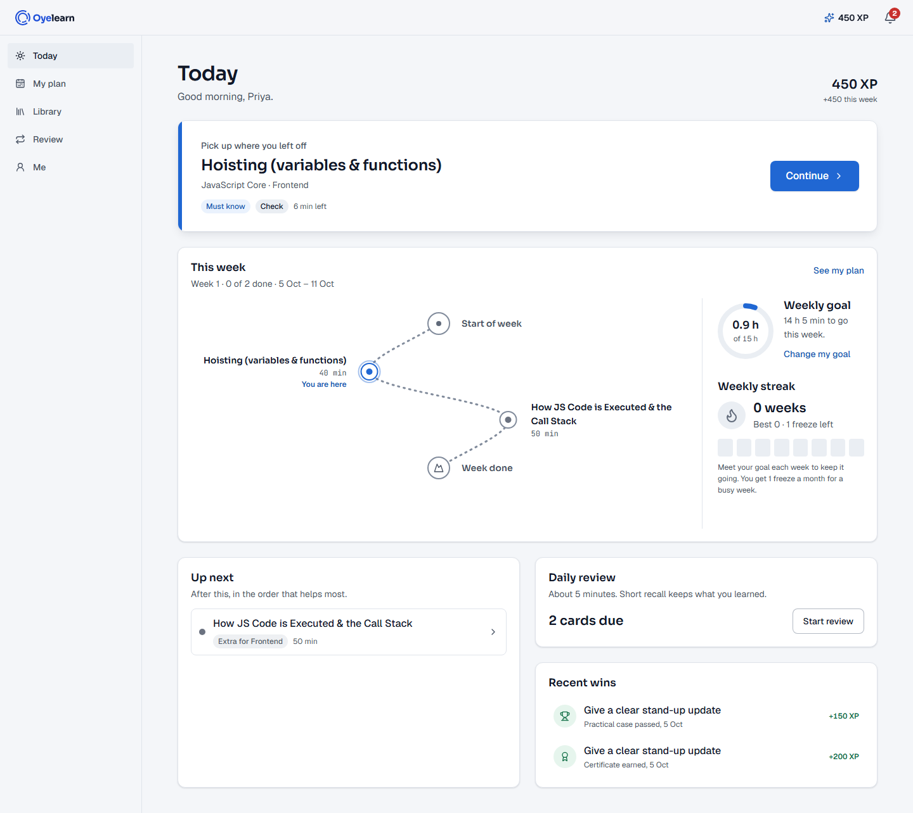 | Today, 390 dark 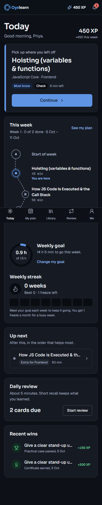 |
| My plan, 1440 dark 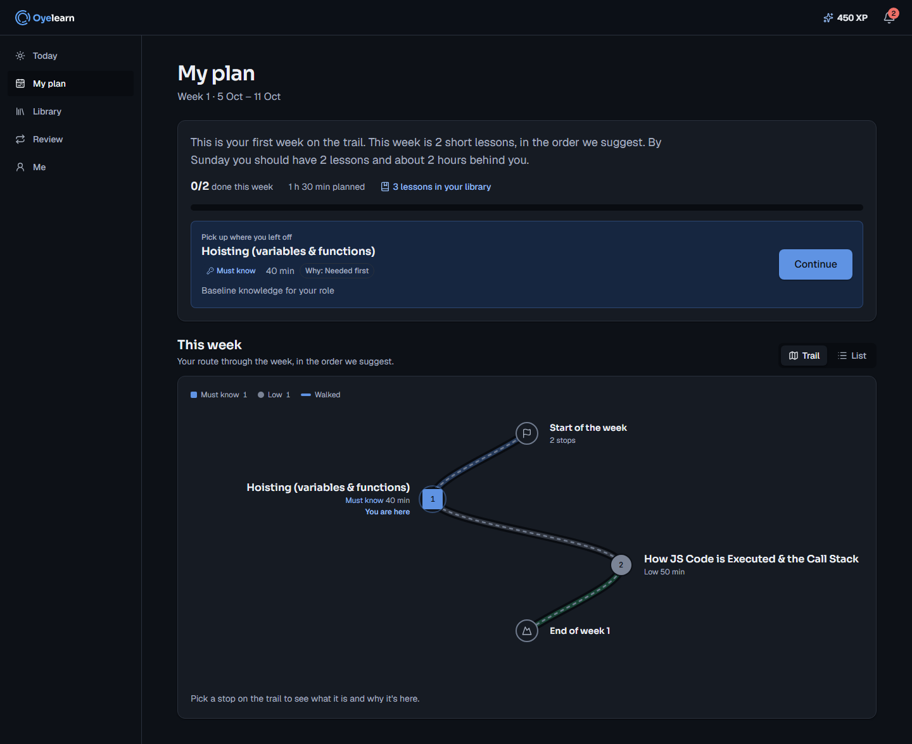 | Lesson Watch, 1440 light 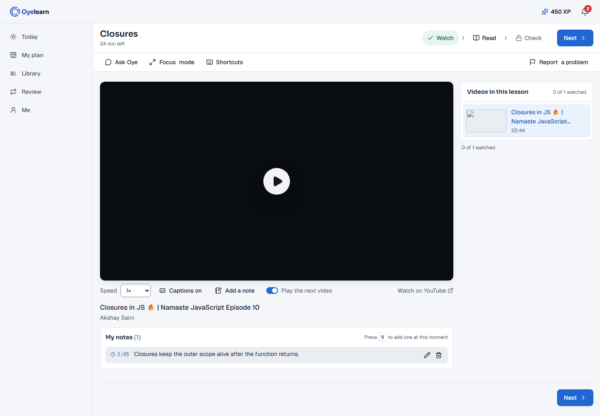 |
| Lesson Do, 390 light 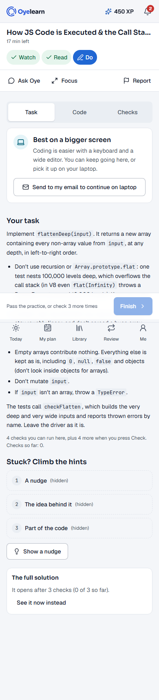 | Review, 390 dark 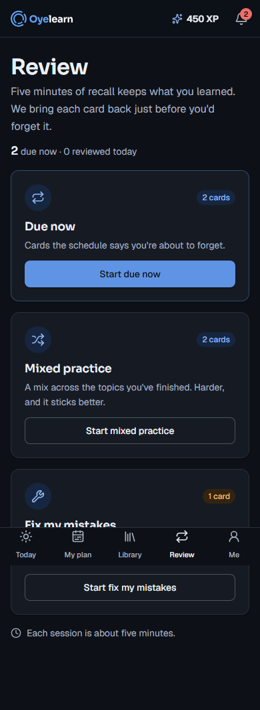 |
| Me, 1440 light 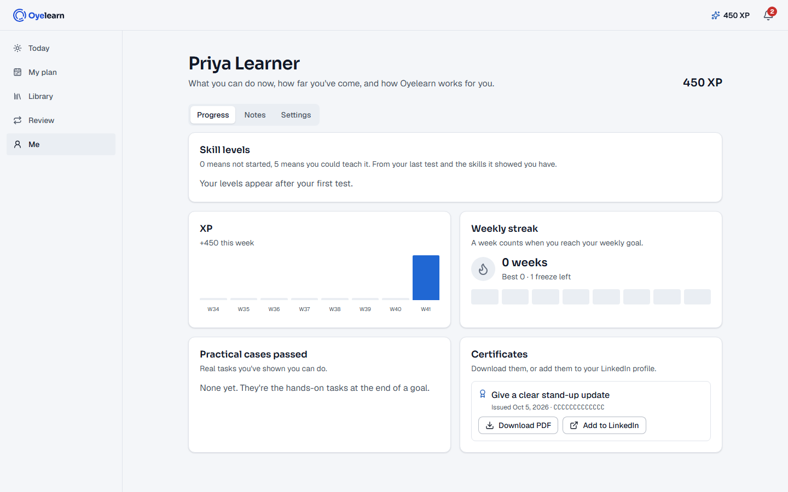 | Test results, 1440 light 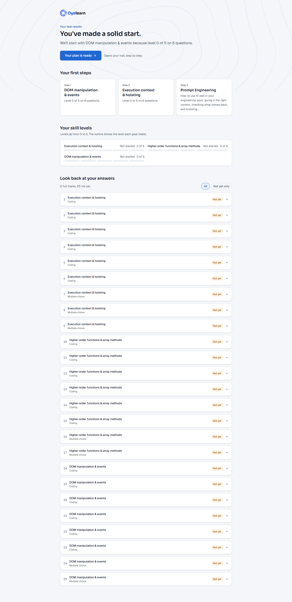 |
| Certificate, 390 light 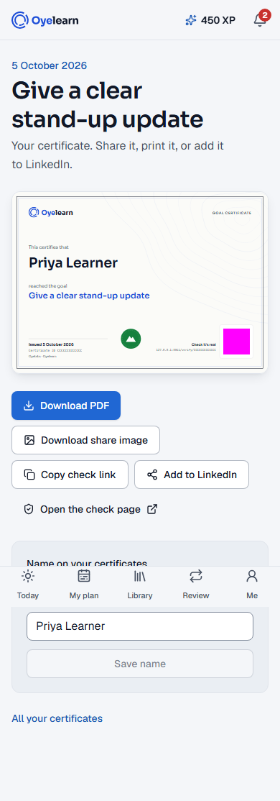 | Admin inbox, 1440 light 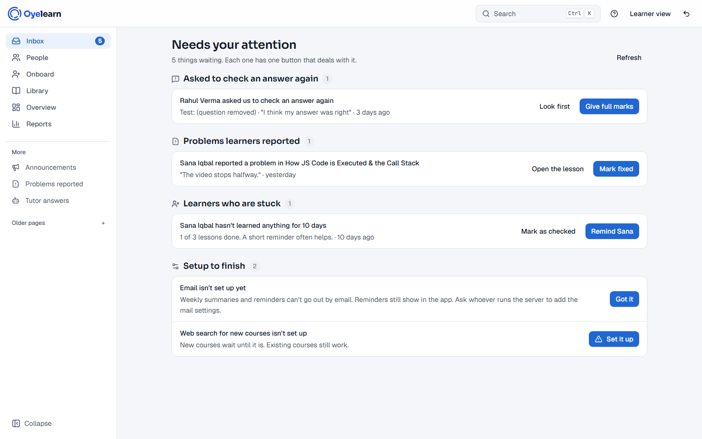 |
| People and side sheet, 1440 dark 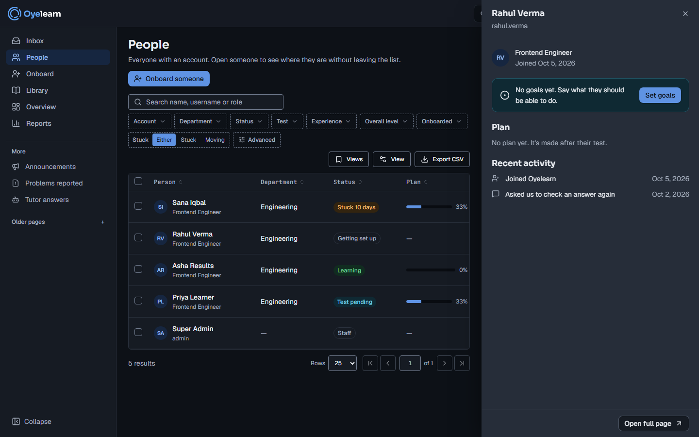 | Reports, 390 dark 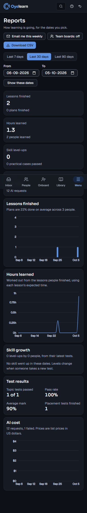 |

## Click counts

Every mouse click counts; typing and waiting don't (the `BASELINE.md` rule).

| Task | Target | Before (v4.4) | v5 |
|---|---|---:|---:|
| Learner: open the app → inside the next step | 1 | 1 | **1** (Today: Continue) |
| Admin: onboard someone and send the test | ≤ 3 | 3 from the admin home | **3** from the inbox (**2** after typing: Suggest, then Looks good — send the test) |
| Admin: approve a review request | 1 | 2 | **1** (Give full marks in the inbox) |

A vague description can add one click, because the "We weren't sure what you meant by…" question must be answered first. That is deliberate error prevention.

## Accessibility

- **Before (v4.4, `BASELINE.md`):** 21 axe issues on 20 routes, 12 of them serious (colour contrast, target size).
- **After:** `v5-a11y` checks **112 views** (every learner and admin route at 390 and 1440, light and dark, plus `/design` and `/verify`) and finds **0 serious or critical**.
- **Also checked:**
  - `v5-mobile-learner`: 16 views at 3 settings.
  - `v5-mobile-admin`: 61 axe checks across 18 routes at 390, 768, 1024 and 1440.
  - `v5-design`, `v5-learner-pages`, `v5-lesson`, `v5-admin`.
  - Every dark pass now asserts `html.dark`. Before Phase 9 some "dark" sweeps actually ran in light.
- **WCAG 2.2 AA notes:**
  - **2.4.11 Focus not obscured:** `scroll-padding` for the sticky header and the phone bottom nav. The e2e checks that no focused control hides under either.
  - **2.5.7 Dragging:** nothing needs a drag. Reordering uses Move up/down buttons or keys, and the split view separator works with the arrow keys.
  - **2.5.8 Target size:** 24 px minimum (checked by axe and the phone sweep). Touch targets are 44 px where it matters.
  - **3.2.6 Consistent help:** Ask Oye sits in the lesson's tool row on every step (a bottom sheet on phones).
  - **3.3.8 Accessible authentication:** no puzzles, and paste is allowed.
  - **Other:** a skip link on every shell; reduced motion from the OS or the Me setting, which also flattens CSS transitions; contrast pairs tested in both themes.
- **Lighthouse accessibility score:** 98–100 on the four measured routes. The 98 was Review's heading order, which has since been fixed.

## Performance

### Bundle sizes (`npm run size`, gzipped, after the Phase 9 size fix)

| Entry | Limit | Size |
|---|---|---|
| `/learn` (Today) | 200 KB | 162.9 KB |
| `/learn/lesson/:id` | 200 KB | 191.4 KB |
| `/learn/plan` | 200 KB | 188.5 KB |
| `/learn/library` | 200 KB | 181.6 KB |
| `/learn/library/:courseId` | 200 KB | 187.0 KB |
| `/learn/review` | 200 KB | 184.2 KB |
| `/learn/me` | 200 KB | 185.7 KB |
| `/admin` inbox | 290 KB (guard) | 271.0 KB |
| `/design` | 230 KB | 221.6 KB |
| Shared entry | 185 KB | 93.2 KB |

- **Before (v4.4):** every learner page downloaded about 696 KB gzipped of JS (2.5 MB raw).
- `check-heavy.mjs` passes: no Monaco, charts, Tiptap, PDF code or MediaPipe in `/learn` or `/design`.

### Lighthouse: before the performance pass (Phase 9.1)

Mobile profile (Moto G Power, slow 4G, 4× CPU), median of 3 runs, through a gzip proxy like production's Caddy, signed in as staff on the new design.

| Route | Perf | A11y | Best practices | LCP | TBT | CLS |
|---|---|---|---|---|---|---|
| `/learn` | 75 | 100 | 93 | 5.79 s | 189 ms | 0 |
| `/learn/lesson/js-closures` | 63 | 100 | 93 | 8.55 s | 402 ms | 0 |
| `/learn/review` | 79 | 98 | 93 | 5.12 s | 102 ms | 0 |
| `/admin` | 70 | 100 | 93 | 6.56 s | 281 ms | 0 |

- **Budgets:**
  - performance ≥ 90: missed on all four;
  - LCP < 2.5 s: missed on all four;
  - accessibility ≥ 90: met everywhere;
  - CLS: 0 everywhere.
- **The cause is mostly a request waterfall:** HTML → entry → `/api/auth/me` → V5App → manifest → page chunk → page data → LCP. Then come about 60 small chunks, one render-blocking CSS file for both designs, the old UI's fonts loaded app-wide, and the YouTube player on the lesson (about 1.3 MB).
- `QUALITY.md` lists the 8 fixes.
- Best practices was 93 because of the CRLF CSP hash bug, which is now fixed (`server/src/lib/csp.ts` normalises line breaks before hashing).

<!-- PERF_AFTER -->
### Lighthouse: after the performance pass

Mobile profile, median of 3 runs, through an HTTP/2 + TLS + gzip proxy (how Caddy serves production). Full detail, including the HTTP/1.1 and bare-Node tables, is in `QUALITY.md` → "Performance after fixes".

| Route | Perf before → after | LCP before → after | A11y | Best practices | CLS |
|---|---|---|---|---|---|
| `/learn` | 86 → **92** ✓ | 3.49 → **2.33 s** ✓ | 100 | 100 | 0 |
| `/learn/lesson/js-closures` | 73 → **90** ✓ | 5.20 → **3.10 s** ✗ | 100 | 100 | 0 |
| `/learn/review` | 94 → **94** ✓ | 2.93 → **2.46 s** ✓ | 100 | 100 | 0 |
| `/admin` | ~90 → **82–95** | 3.1 → **2.8–3.0 s** ✗ | 100 | 100 | 0 |

**What landed:**
- The route's data, fonts and the lesson poster now start from the HTML, so pages no longer wait in a chain.
- Lessons preload only the steps they have, and heavy task kinds load lazily.
- Video uses a thumbnail with a Play button; YouTube's 1.3 MB player loads only on Play.
- The old design's fonts load only in the old UI.
- Node serves brotli and gzip copies of assets itself.
- The CSP bug with Windows line endings is fixed, which took best practices from 93 to 100.
- Not done: splitting the CSS per design would change the old UI's look, and every chunk-grouping setup made routes bigger.

**Still over the LCP budget:**
- **Lesson (3.1 s):** the largest element is the 35 KB YouTube poster from `i.ytimg.com`. Under 2.5 s needs a product choice: the smaller, blurry `mqdefault` poster, no poster, or serving it from our own origin.
- **Admin:** staff-only and mostly desktop. The next step is lazy-loading the command palette and help dialog.

Bundle sizes after the pass: every learner route is still under 200 KB (lesson 196.3 KB, the tightest). `npm run size` is green.
<!-- /PERF_AFTER -->

## Tests

**Unit tests:** `npm test` (Vitest), **2,542 passing** at the last run. The new v5 tests cover, among other things:
- the design tokens and contrast;
- streak, XP and FSRS logic;
- lesson gating and the server's claim checks;
- tutor grounding;
- review cards;
- inbox rules and Undo;
- versions and restore;
- precache and chunk reload;
- offline Review;
- send-to-email;
- the client error log;
- plain titles and reasons.

**End-to-end scripts** (`scripts/e2e/`, each on its own port and throwaway data, with mock AI):

| Script | What it covers |
|---|---|
| `v5-baseline.ts` | The v4.4 "before" screenshots, click counts, axe and JS sizes |
| `v5-foundation.ts` | The flag: old/new switching, old URL redirects, the staff `?ui=` override, `/verify` signed out, nothing old in `/learn`'s JS |
| `v5-design.ts` | `/design` at 390/1440 light/dark, axe, dialogs, palette, flashcard, hint gate, reduced-motion celebration |
| `v5-today.ts` | Today: hero, trail, ring, streak, Up next, axe |
| `v5-lesson.ts` | Watch, Read, Do and Check, gating, notes, Ask Oye, axe |
| `v5-learner-pages.ts` | My plan, Library, the course page, Review, Me, axe on 9 views |
| `v5-assessment.ts` | Pre-flight, sheet, results, certificate, verify |
| `v5-motivation.ts` | Welcome, XP and celebrations, the bell, reminders, team boards |
| `v5-admin.ts` | Inbox actions and click counts, People, onboarding, editor, reports, axe |
| `v5-mobile-learner.ts` | Phone layouts, coding tabs, send to email, optimistic rating, skeletons and Try again, the 390 sweep |
| `v5-mobile-admin.ts` | The tablet rail, the phone Menu, the People sheet, Undo, 61 axe checks |
| `v5-pwa.ts` | Manifest, installability, update prompt, offline Review and sync, sign-out wipe |
| `v5-a11y.ts` | axe on 112 views, keyboard and skip link, 2.4.11, reduced motion |
| `v5-review-shots.ts` | The UX review's before and after screenshots and click counts |
| `v5-journeys.ts` | The learner journey from `/` through a full lesson and a topic test; admin full marks, onboarding, People sheet, editor save, CSV |
| `v5-visual.ts` | 176 pixel-compared baselines (22 screens × 390/768/1280/1440 × light/dark) |

The older scripts (`v4-departments`, `v41-personalise`, `v42-pm-processes`, `v43-*`, `v44-reference-case`) test the old design and run with `UI_V5_DEFAULT=off`.

## Switch-on

- **`ui_v5` is on by default.** With no saved global setting, the fallback is "on".
- **What wins over the fallback:**
  - a super admin's saved choice (`app_meta` `ui.v5_default`, through `PUT /api/admin/settings/ui`);
  - each person's own choice.
- **`UI_V5_DEFAULT=off`** in the server environment makes the old design the default again, with no code change. It only applies while no global setting is saved.
- **"Use previous design"** is under Me → Settings for learners, and on the admin top bar for staff. Every switch is written to the audit log as `ui.v5_toggle`. The old design has a "Try the new design" link to come back.
- **The previous design stays for 2 weeks after the deploy.** Then the old UI code is removed.
  - **Follow-up task:** remove the old UI.
  - **Target date:** deploy date + 14 days (**fill in after the deploy: ____**).
  - **What it removes:** `LegacyRoutes` and the old pages, the flag switch in `App.tsx`, the "Try the new design" link, and the old fonts and CSS. The fallback then stays "on" for good.

## Email

Email is off unless it's set up (see "Email is off unless set up" in `DECISIONS.md`). Without `SMTP_*` / `MAIL_*` settings:
- v5 queues no emails at all;
- reminders still go to the in-app bell;
- the weekly-email settings are hidden;
- the phone coding step offers "Copy the link".

Nothing is needed for the deploy. To turn email on later, add the settings documented in `.env.example` and restart.

## Needs Abhishek

1. **The deploy and smoke test** (`docs/v5/DEPLOY.md`), then fill in the removal date above. `main` is ahead of `origin`, so push first (see DEPLOY.md step 0).
2. **Lighthouse against the live site**, with a staff login:
   ```bash
   LHCI_BASE_URL=https://learn.oyegen.com LHCI_USERNAME=<staff user> LHCI_PASSWORD=<password> npm run lhci
   ```
   It defaults to the mobile profile and the four routes above. Reports go to `.lighthouseci/`.
3. **Remove the old UI** after 2 weeks (above). Before then, look at how many people chose "Use previous design" in the audit log (`ui.v5_toggle`).
4. **Decisions carried over from the phases:**
   - The **LinkedIn "Add to profile"** link uses the widely used URL format. LinkedIn doesn't document its parameters, so try it once on a real certificate.
   - **Two fixes touch the old UI and need your sign-off** under rule 1:
     - the shared table toolbar's search box squeezes to nothing on phones (`DataTableToolbar.tsx`, `basis-full sm:basis-auto`);
     - onboarding's two "edit" links (On2).
   - The **client error log** is in memory (the last 200, staff can read 50). Decide whether it should be a table that survives restarts.
   - **Offline Review:** ratings made offline are lost if the learner signs out before they sync (accepted). Ratings made later in the old design don't flow back into FSRS (accepted).
   - **Research items that couldn't be fetched** (`RESEARCH.md` §7) are listed there to check by hand if they matter.

## Known gaps and backlog

- **Performance:** the 9.1 budgets (perf ≥ 90, LCP < 2.5 s on mobile) were missed. The fixes are in `QUALITY.md`; see the PERF_AFTER section for what landed.
- **UX backlog:** 28 low findings in `UX_REVIEW.md`, among them:
  - XP shown twice on Today, and two sets of lane words ("Low" vs "Extra");
  - the "Week done" spacing;
  - Review rating times with no label;
  - ISO week numbers on the XP chart;
  - the bell's linked items looking the same as plain ones;
  - the "Focus  mode" double gap;
  - empty Read takeaways, and the test driver in the starter code;
  - a finished Check showing an unanswered quiz;
  - a long pre-flight;
  - the all-caps certificate eyebrow;
  - the icon-only "Use previous design" on the admin top bar;
  - "Make it live" not being the primary button;
  - the AI cost chart's zero state;
  - the "Team boards: off" wording.
- **Smaller code follow-ups from DECISIONS:**
  - the learner bottom-nav labels are 11 px (`shells.tsx`; should be 12 px);
  - a `--v5-bottom-nav-h` variable;
  - an `AppShell` rail mode, so the admin can drop `AdminFrame`;
  - a `SplitView` phone-tabs option;
  - `lesson_state.solution_traded_at` (the flag rides in `step_done` for now);
  - the lesson player should read `?video=` from notes links and handle `?course=` links;
  - a raw control character in `server/src/ai/adapters/mockPersonalise.ts`.
- **`.env.example`'s email comment is out of date.** It still says emails are "marked skipped" and the inbox shows "Email isn't set up yet", which was true before the "Email is off" change. `UI_V5_DEFAULT` isn't in `.env.example` yet.
- **There is no admin screen for the global design default.** It's set through `PUT /api/admin/settings/ui` (super admin) or `UI_V5_DEFAULT`.
- **The tag `v5.0.0`** is made with the final commit (9.6).
